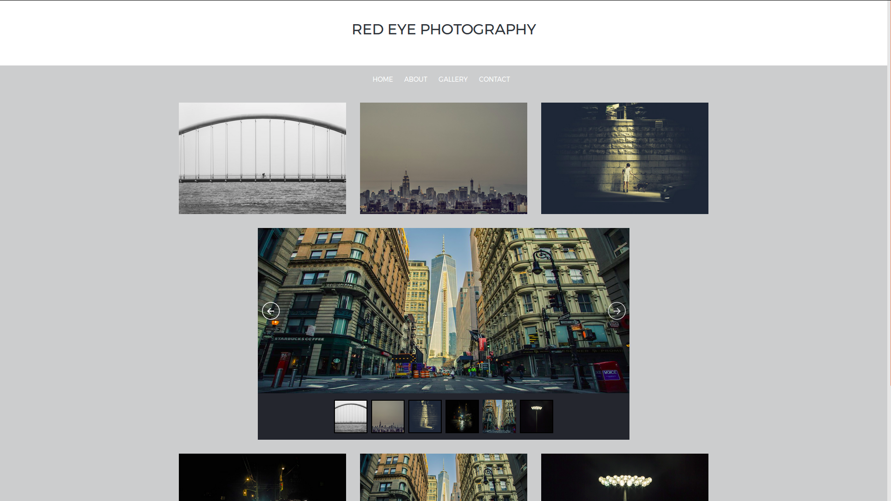

This is a Front-end project building with HTML,CSS, bootstrap and with a Jquery library for the slides. This was built with the purpose to work with the core concepts of Front-end Web Development, because I strong believe that hands-on project is the best way to practice and learn.

You can see it working in my <a href="http://codepen.io/LuKrebs/full/gmqogR/">CodePen profile</a>. Feel free to use the template in your own project or to message me if you want some adicional information.

This image give us a little taste what this front-end project looks like: 

